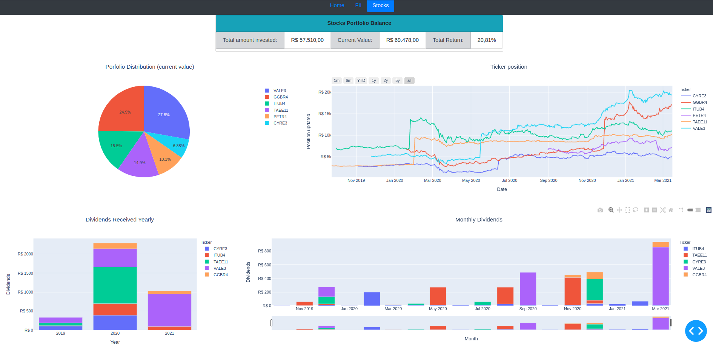
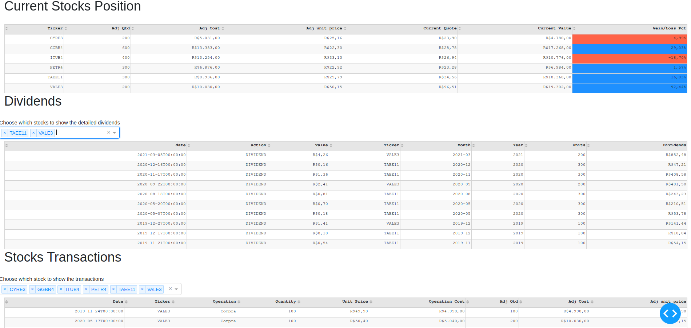
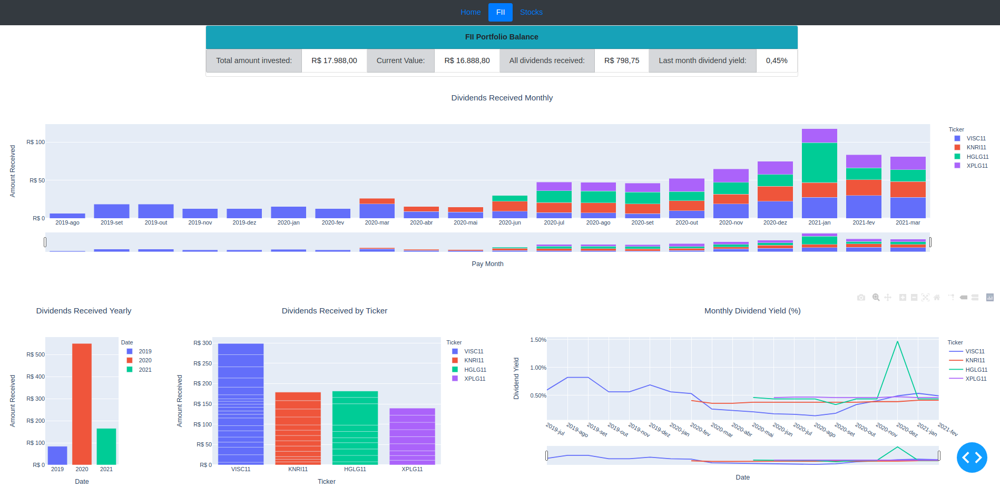

# My investments portfolio tracker


[](https://github.com/thobiast/myinvestments/blob/main/LICENSE)
[](https://github.com/psf/black)

A simple portfolio tracker to help analyze investments and to keep
focus on buy and hold strategy and dividends.

### Usage

It reads csv files with transactions and generates insights about the investments.
By default it reads sample transaction files on directory "*example\_transactions*".
In order to read a diferent csv file, you can set environment variables
"*STOCKS\_TRANSACTIONS*" and "*FII\_TRANSACTIONS*".

```bash
$ export FII_TRANSACTIONS='myfiles/fiis.csv'
$ export STOCKS_TRANSACTIONS='myfiles/stocks.csv'
```

### Interfaces

There are two interfaces available: web dashboard and command-line.

#### Dashboards

Run the *index.py*. It will open a local web application. Open a browser
and point it to *http://127.0.0.1:8050/*

Stocks:



FII:



#### Command line

```bash
$ ./portfoliocli.py
usage: portfoliocli.py [-h] [-d] {stocks,fii} ...

My investments tracker command line

optional arguments:
  -h, --help    show this help message and exit
  -d, --debug   debug flag

Commands:
  {stocks,fii}
    stocks      Portfolio stocks information
    fii         Portfolio FII information

    Exemplos de uso:
        portfoliocli.py -h
        portfoliocli.py fii -h
        portfoliocli.py fii -p
        portfoliocli.py stocks -p
```

```bash
$ ./portfoliocli.py fii -p
    Ticker  Adj Qtd  Adj Cost  Adj unit price  Current Quote  Current Value  Gain/Loss Pct
12  HGLG11       20  3,575.00          178.75         176.00       3,520.00          -1.54
7   KNRI11       30  5,030.00          167.67         151.10       4,533.00          -9.88
4   VISC11       50  5,595.00          111.90         108.50       5,425.00          -3.04
9   XPLG11       30  3,788.00          126.27         113.61       3,408.30         -10.02
```
